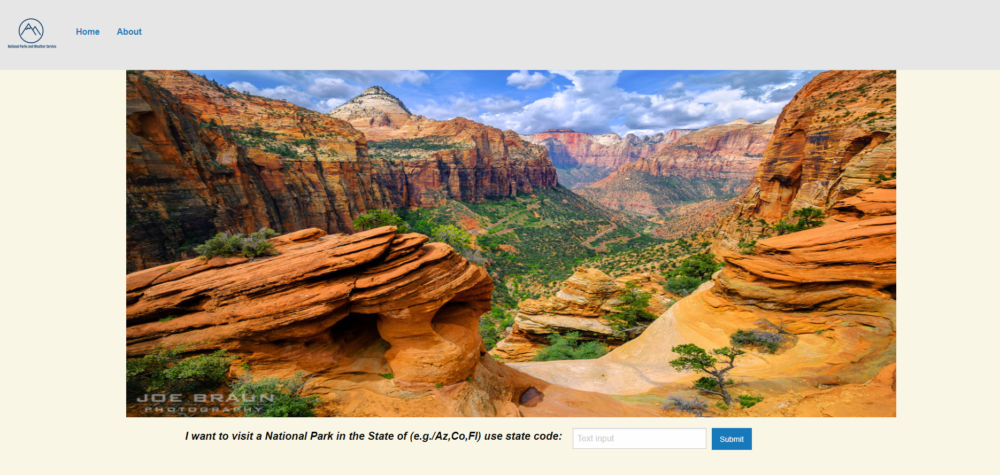
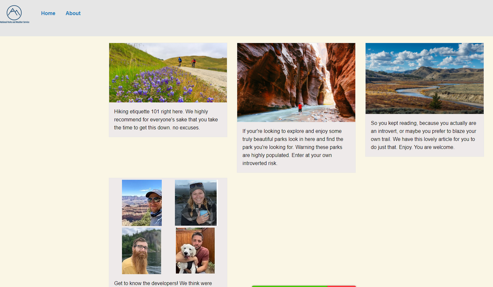
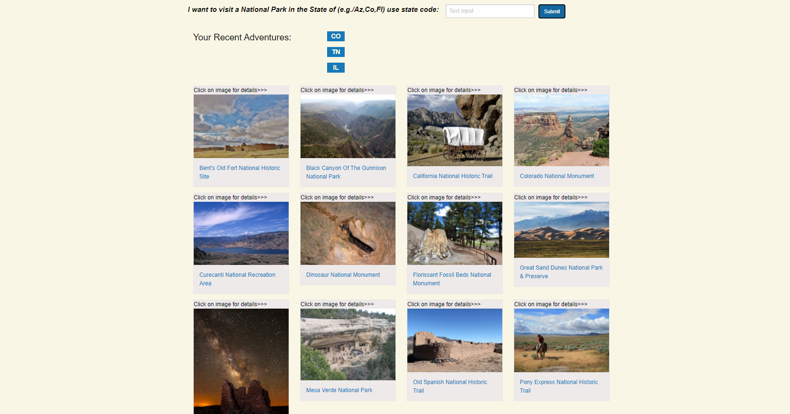

# Project-1-DU-Bootcamp
As a user I want to search for the nearest national park to a given location, so that I know when the park is open and closed and I can find the available activities to plan my vacation. Also I want to know the local weather so that I can plan accordingly.

## Installation
Nothing is required of the User

## Usage
- When I enter the homepage I am greeted with two options for navigating
    - search bar
    - nav bar
- When I search by state code
- I am given all the National Parks for that state, and the last four state code appends to the page under recent adventures
- When I click on a parks image
- I am given the weather for that parks latitude and longitude, activities, fees, and operating hours 
- When I click on the name of a park
- I am taken to that parks specific NPS site
- When I click on About in nav bar
- I am given extra resources, and beautiful people
- When I click on the state appended to the page
- I am brought to all of the parks for that state

## License
- MIT License

## Screenshots

- Home Page

- About Page

- Park Page

- Search Results

## Features
1. National Park Service API
    https://www.nps.gov/subjects/developer/api-documentation.htm
2. Open Weather API
    https://openweathermap.org/api
3. Foundation CSS
    https://get.foundation/

## Links
1. [github.io](https://tolgas92.github.io/Project-1-DU-Bootcamp/) 
2. [github](https://github.com/TolgaS92/Project-1-DU-Bootcamp)

## Libraries
1. jQuery
2. Foundation

## Credit

- MUHA04/GETTY IMAGES

- http://worldbeautifullplaces.blogspot.com/2012/05/glacier-national-park-usa.html

- http://getwallpapers.com/collection/glacier-national-park-wallpaper

- https://windows10spotlight.com/images/d93c385aff37589622efe87f7d095806

- Joe Braun, https://www.citrusmilo.com/zionguide/

## Authors
- Morgan Franke
- Tolga Secme
- Rob Koch
- Nathan Forgille