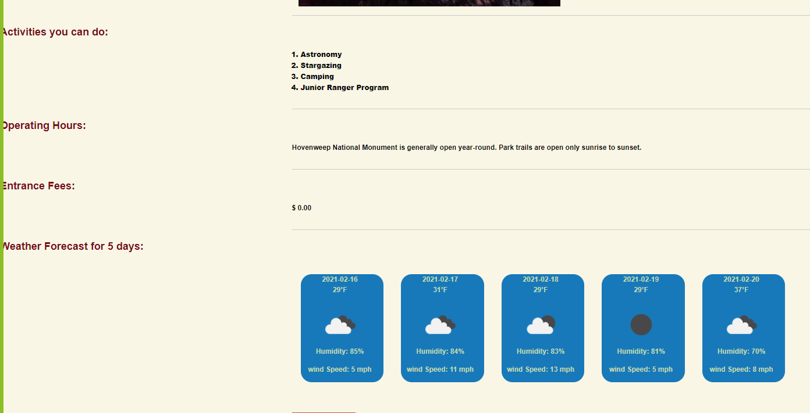

# Project-1-DU-Bootcamp

As a user I want to search for the nearest national park to a given location, so that I know when the park is open and closed and I can find the available activities to plan my vacation. Also I want to know the local weather so that I can plan accordingly.

## Installation

Nothing is required of the User

## Usage

- When I enter the homepage I am greeted with two options for navigating
  - search bar
  - nav bar
- When I search by state code
- I am given all the National Parks for that state, and the last four state code appends to the page under recent adventures
- When I click on a parks image
- I am given the weather for that parks latitude and longitude, activities, fees, and operating hours
- When I click on the name of a park
- I am taken to that parks specific NPS site
- When I click on About in nav bar
- I am given extra resources, and beautiful people
- When I click on the state appended to the page
- I am brought to all of the parks for that state

## License

- MIT License

## Screenshots

- About Page
  
- Park Page
  
- Search Results
  

## Features

1. National Park Service API
   https://www.nps.gov/subjects/developer/api-documentation.htm
2. Open Weather API
   https://openweathermap.org/api
3. Foundation CSS
   https://get.foundation/

## Links

1. [github.io](https://tolgas92.github.io/National-Parks-and-Weather-Services/)
2. [github](https://github.com/TolgaS92/National-Parks-and-Weather-Services)

## Libraries

1. jQuery
2. Foundation

## Credit

- https://www.1zoom.me/en/wallpaper/537305/z4323.9/1920x1080
  
- https://hdqwalls.com/download/1920x1080/grand-canyon-national-park
  
- https://www.ingoscholtes.photo/portfolio/yosemite.html
  
- https://www.wallpapers13.com/bryce-canyon-and-zion-national-park-utah-united-states-huge-red-and-brown-mountains-hd-wallpapers-for-mobile-phones-tablet-and-laptop-1920x1200/
  
- https://akspic.com/image/7789-mountainous_landforms-glacier_national_park-nature_reserve-mountains-nature/1920x1080

## Authors

- Morgan Franke
- Tolga Secme
- Rob Koch
- Nathan Forgille
